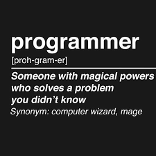

## Kuama Developer Test

Given the following json

```json
{
  "details": [
    {
      "payment_type": "priority",
      "beneficiary_entity_type": "individual",
      "fields": {
        "beneficiary_last_name": "^.{1,255}",
        "beneficiary_address": "^.{1,255}",
        "iban": "([A-Z0-9]\\s*){15,34}",
        "beneficiary_city": "^.{1,255}",
        "beneficiary_first_name": "^.{1,255}",
        "bic_swift": "^[0-9A-Z]{8}$|^[0-9A-Z]{11}$"
      }
    },
    {
      "payment_type": "priority",
      "beneficiary_entity_type": "company",
      "fields": {
        "beneficiary_company_name": "^.{1,255}",
        "beneficiary_address": "^.{1,255}",
        "iban": "([A-Z0-9]\\s*){15,34}",
        "beneficiary_city": "^.{1,255}",
        "bic_swift": "^[0-9A-Z]{8}$|^[0-9A-Z]{11}$"
      }
    },
    {
      "payment_type": "regular",
      "beneficiary_entity_type": "individual",
      "fields": {
        "iban": "([A-Z0-9]\\s*){15,34}"
      }
    },
    {
      "payment_type": "regular",
      "beneficiary_entity_type": "company",
      "fields": {
        "iban": "([A-Z0-9]\\s*){15,34}"
      }
    }
  ]
}
```
Create a UI that will show
- [ ] a dropdown that will show all the different `beneficiary_entity_type` options  (given the current json, the dropdown should contain `individual` and `company`)
- [ ] when the dropdown changes its value (the user selects an option), the following should be shown:
    - [ ] a section for each `payment_type` of the selected `beneficiary_entity_type`
    - [ ] each section should contain N inputs, as many as the one listed under the key `fields`
    - [ ] following fields, when needed, should be presented in a separate section
      - `"beneficiary_first_name"`
      - `"beneficiary_last_name"`
      - `"beneficiary_company_name"`


An example of the final result can be seen [here](https://share.vidyard.com/watch/7YmoyYbmZwHbjbTD4qCWK1?)

Style the UI as you prefer, and use any framework you prefer

If short on time, at least print the list of strings that should be used in a log of your choosing.

## Bonus points
This is not a list to be followed top-bottom, just some enhancements you can do to show off 🙌 🚀
- [ ] Store the json in a file and read it
- [ ] Serve the json from a restful api
- [ ] Add some transitions / animations

## How to deliver
If you know how: clone this repository, create a separate branch and make a PR

Otherwise: will read the code from your machine

## What will be rated?
- Code readability
- How you structure your project
- WTFs/minute

Remember: **it is not a problem if you don't complete your test**, as long as you keep our WTFs/minutes at a minimum.

And remember:




Have fun!

With ♥️ from Kuama folks

